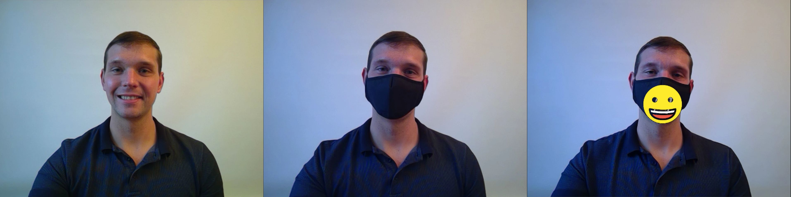

# Webcam Augmentation with Python and ArUco Markers

This repository demonstrates how easy we can bring emotions back to video chat programs when wearing face masks.
Imagine you are in an important video meeting while you are at a public place or a train where face masks are mandatory. You could be misunderstood as you have limited opportunities to express your emotions.
By attaching an ArUco marker to your face mask and using my python script, you can easily enhance your emotions. 
I used this script to teach my students basics of augmented reality. The emojis were taken from [OpenMoji](https://openmoji.org/).

## Howto start
- [Read the Tutorial](Tutorial/README.md)
- Print the ArUco marker
- Cut out the marker with a white frame
- Attach the marker
	

- Start your video chat program and select the OBS webcam
- Start the Python script
- Keep the window to the front to control the augmented output

## Controls

| Key  | Function |
| ------------- | ------------- |
| 0 to 9  | Overlay emoji |
| +  | Increase size of emoji |
| -  | Decrease size of emoji |
| w  | Stop overlaying emoji |
| q  | Stop script |

	
##

This repository is provided by the Human-Computer Interaction Group at the University Hannover, Germany. For inquiries, please contact Maximilian Schrapel maximilian.schrapel@hci.uni-hannover.de
